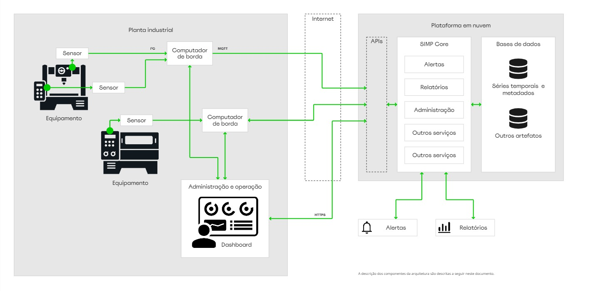
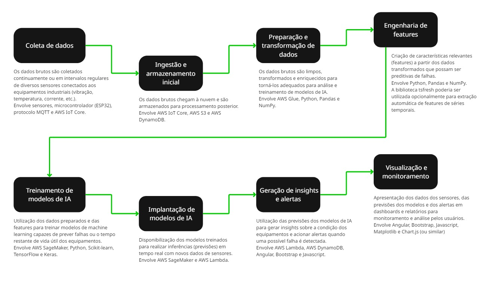

## FIAP - Faculdade de Informática e Administração Paulista

    

 

# Reply - Enterprise Challenge - SIMP - Sistema Inteligente de Manutenção Preditiva
### Sprint 1

## Grupo TiãoTech

## Integrantes
- <a href="https://www.linkedin.com/in/edmilson-marciano-02648a33">Edmilson Marciano</a>
- <a href="https://www.linkedin.com/in/jayromazzi">Jayro Mazzi Junior</a>
- <a href="https://www.linkedin.com/in/leocamacho">Leonardo Camacho</a>
- <a href="https://www.linkedin.com/in/lucas-a-5b7a70110">Lucas Arcanjo</a> 

## Professores
### Tutor(a) 
- <a href="https://www.linkedin.com/in/lucas-gomes-moreira-15a8452a">Lucas Gomes Moreira</a>
### Coordenador(a)
- <a href="https://www.linkedin.com/in/andregodoichiovato">Andre Godoi Chiovato</a>

---

## Conteúdo

- [Visão geral do SIMP](#visão-geral-do-simp)
- [Tecnologia empregada](#tecnologia-empregada)
    - [Linguagens de programação](#linguagens-de-programação)
    - [Bibliotecas de IA](#bibliotecas-de-ia)
    - [Serviços de nuvem](#serviços-de-nuvem)
    - [Bancos de dados](#bancos-de-dados)
- [Arquitetura geral](#arquitetura-geral)
- [Fluxo de dados](#fluxo-de-dados)
- [Plano inicial de desenvolvimento](#plano-inicial-de-desenvolvimento)
- [Ideias para evolução](#ideias-para-evolução-implementação-futura)

Veja em [enterprise_challenge_reply.pdf](documents/enterprise_challenge_reply.pdf) a reprodução do conteúdo deste README, editorado para impressão.

## Descrição

## Visão geral do SIMP
    
### Visão contextual

O sucesso de uma indústria depende em muito do desempenho de suas linhas produtivas e do aproveitamento otimizado dos equipamentos que as integram, sendo que grande parte dos investimentos realizados por essas empresas volta-se para a aquisição e manutenção desses equipamentos, de forma que o minucioso planejamento de suas operações transcorra de forma harmoniosa e perene, gerando o almejado retorno financeiro. 
Por essa razão, sempre que o ritmo de produção se interrompe em função de falhas de equipamentos, toda a cadeia operativa se quebra, sobrepondo prejuízos à empresa, até que a operação seja retomada.

### Descrição do projeto

O presente projeto trata da concepção e desenvolvimento de um sistema inteligente de manutenção preditiva (SIMP) e, como tal, seu principal objetivo é permitir que administradores e técnicos de plantas industriais tenham à disposição informações avançadas sobre falhas futuras em equipamentos estratégicos. Com posse dessas informações, medidas corretivas poderão ser adotadas e ações de manutenção preventiva poderão ser levados a efeito, resguardando a integridade dos equipamentos e preservando a sanidade do processo produtivo.
O SIMP terá como base o uso de Inteligência Artificial que, a partir do monitoramento dos equipamentos da planta, poderá inferir futuras falhas, apontar possíveis causas e propor iniciativas de mitigação avançadas.
    
O setor industrial conta hoje com sistemas de gerenciamento de processos (SCADA) e de ativos (EAM), que em parte se assemelham ao projeto proposto, porém com diferentes focos. Ainda que futuramente possa operar de forma integrada a tais sistemas, o SIMP se volta especificamente para o gerenciamento da saúde do fluxo produtivo, atuando diretamente no monitoramento de equipamentos de forma preditiva, com os seguintes diferenciais:

- Pode combinar dados originados em múltiplos sensores, que, analisados de forma sincronizada, permitem construir evidências mais acertadas e robustas.
- Emprega ferramentas de Inteligência Artificial e Machine Learning para notificar de forma avançada sobre a possível ocorrência de falhas futuras.
- Pode ser treinado antecipadamente a partir de dados históricos, reais ou simulados.
- A acurácia de suas predições aumenta em razão temporal, ou seja, sua própria operação fornece os insumos de que precisa para tornar suas informações mais acertadas 
    
## Tecnologia empregada
    
No âmbito do presente projeto, contaremos com um leque reduzido de opções de tecnologia, de acordo com as limitações de aprendizado e acesso. Ainda assim, esta é uma visão inicial das necessidades de tecnologia. Ela poderá ser alterada em função de achados e estudos futuros, durante os trabalhos de aprofundamento inicial ou mesmo durante o desenvolvimento.

### Linguagens de programação

- *Python* - Desenvolvimento back-end
- *R* - Análise de dados e desenvolvimento de ferramentas estatísticas
- *Angular / Bootstrap* - Desenvolvimento front-end
- *HTML / CSS* - Desenvolvimento front-end

### Bibliotecas de IA

Para o desenvolvimento geral do núcleo inteligente do SIMP, há diversas bibliotecas que já são largamente utilizadas no ecossistema Python, das quais destacamos as seguintes e que serão mais comumente utilizadas:

- *Scikit-learn* - Desenvolvimento de algoritmos de ML, seleção e avaliação de modelos de ML.
- *Pandas* - Oferece estruturas de dados que facilitam a manipulação, higienização e análise de dados.
- *NumPy* - Fundamental para computação numérica em Python. Oferece estruturas de dados avançadas e funções matemáticas de alto nível.
- *Matplotlib* - Usada para criar visualizações estáticas, interativas ou animadas, em Python.
- *TensorFlow* - Uma biblioteca open source bastante poderosa, oltada principalmente para deep learning. Será utilizada para criar e treinar redes neurais.
- *Keras* - Simplifica o processo de desenvolvimento e de experimentação com arquiteturas baseadas em redes neurais.

### Serviços de nuvem

Embora o desenvolvimento inicial de POCs ou mesmo de MVPs possa se valer de implementações locais, o SIMP apresenta um grande potencial para utilização de serviços em nuvem. Dentre as razões, podemos destacar as seguintes:

- Escalabilidade facilitada
- Alta disponibilidade e confiabilidade
- Acesso a tecnologias específicas
- Segurança robusta
- Menor necessidade de gerenciamento de infraestrutura
- Produtização (SaaS) facilitada

Como opção inicial, selecionamos alguns serviços da AWS, por oferecerem amplo suporte às bibliotecas utilizadas, além de vários outros serviços, operando de forma integrada, voltados ao gerenciamento em nuvem de sistemas de ML e Ia em geral.
Dentre os serviços em nuvem previstos, teremos os seguintes:

- *AWS IoT Core* - Conexão e gerenciamento de dispositivos IoT (sensores e computadores de borda)
    
- *AWS EC2* - Serviço de computação em nuvem, adequado às necessidades do SIMP. Oferece controle total sobre a infraestrutura e escalabilidade, mas, por isso mesmo, demanda maior esforço de gerenciamento para manter o faturamento sob controle.
    
- *AWS Glue* - Simplifica as atividades de descoberta, preparação, transporte a análise dos dados de fontes diversas, assim como a automatização do pipeline de dados.

- *AWS SageMaker* - Serviço de ML em nuvem, que viabiliza a construção, treinamento e implantação de modelos de ML de forma mais rápida e facilitada.

### Bancos de dados

As opções adotadas de bancos de dados são totalmente adequadas às estruturas que utilizaremos, ou seja, séries temporais, metadados, dados brutos massivos, além de escalabilidade facilitada.

*Oracle Cloud Database Service*
- Persistência de dados em estrutura relacional
- Operação semelhante on-premises e em nuvem
- Transição facilitada para nuvem 

*AWS DynamoDB*
- Adequado para o treinamento e processamento bruto de dados
- Auto desempenho para ingestão de dados de tempo real
- Escalabilidade automática
- Flexibilidade  de modelos de dados
- Integração nativa com serviços AWS, como AWS IoT Core, AWS Lambda e AWS S3, entre outros, adequados à solução proposta.

*AWS S3*
- Serviço de armazenamento de objetos, será usado para armazenamento geral de dados brutos, logs, documentos e artefatos dos modelos de IA etc.

## Arquitetura geral

*Arquitetura geral inicial do SIMP*

### Descrição dos componentes

### Equipamento

Máquinas, dispositivos e outros equipamentos industriais monitorados pelos sensores do SIMP. Recebem uma categorização inicial segundo o tipo dos sinais coletados (eq. rotativo, elétrico, hidráulico etc.), que permite o dimensionamento inicial da rede de sensores e computação de borda para monitoramento.

### Sensor 

Dispositivo especializado acoplado ao equipamento, para coleta de dados brutos. Podem ser de vários tipos, dependendo do tipo de sinal a ser monitorado. Inicialmente, serão contemplados:

- Temperatura
- Vibração
- Pressão

### Computador de borda

Dispositivos computacionais conectados aos sensores e posicionado próximo ao equipamento monitorado. Responsável por:

- Agregação de dados
- Filtragem
- Pré-processamento

Inicialmente serão usados dispositivos ESP32, por apresentarem uma relação custo x benefício bastante favorável ao contexto do projeto. 
O tráfego de dados entre o sensor e o ESP32 depende do tipo de interface oferecida pelo sensor. Muitos dos sensores dos tipos que iremos utilizar num primeiro estágio valem-se do protocolo I²C, que requer uma conexão física de 2 fios entre sensor e ESP32.
Inicialmente, a conexão do ESP32 com a nuvem será realizada mediante o protocolo MQTT e um serviço de broker (por ex.: AWS IoT Core).

### Plataforma em nuvem

Concebida para ser o núcleo do sistema, concentra as seguintes funcionalidades:

- *Ingestão de Dados* - Recebimento e organização dos dados dos dispositivos de borda.
- *Armazenamento* - Persistência dos dados em bancos de dados.
- *Processamento* - Execução de algoritmos de análise e modelos de IA.
- *Serviços de Machine Learning* - Ferramentas para construir, treinar e implantar modelos de IA.
- *Gerenciamento de alertas* - Disparo configurável de alertas de anomalias e de falhas previstas ou iminentes, via SMS, email etc.
- *Gerenciamento de relatórios* - Emissão de relatórios sobre a saúde de equipamentos e predição de eventos futuros.
- *MQQT Broker* - Basicamente, gerencia a comunicação entre os computadores de borda e a aplicação em nuvem, usando o protocolo MQTT. 

A plataform em nuvem considera também a integração com os serviços em nuvem, responsáveis, no todo ou em parte, por algumas das funcionalidades relacionadas acima.

## Fluxo de dados

Segue uma descrição da pipeline de dados, desde a coleta via sensores até a geração de insights, com as etapas de utilização e transformação de dados.

*Fluxo de dados de produção do SIMP*

A imagem acima um esboça o fluxo de dados de produção. Ela é focada em operacionalizar o modelo de machine learning treinado para gerar previsões em tempo real ou quase real com os novos dados dos sensores que chegam continuamente. Seu objetivo é fornecer insights (alertas e previsões).

### Pipeline de desenvolvimento

Durante as fases de desenvolvimento, o fluxo de dados poderá ser ligeiramente alterado, terá uma natureza mais exploratória e estará mais voltado a explorar os dados históricos e simulados, experimentar diferentes técnicas de preparação de dados, engenharia de features e algoritmos de machine learning, treinar e avaliar modelos. O objetivo é desenvolver e validar modelos preditivos eficazes antes de sua implantação em produção.

## Plano inicial de desenvolvimento
    
A presente proposta de roadmap abstrai a necessidade de integração com o andamento dos módulos de aulas da FIAP. Ele apresenta uma visão de alto nível com a divisão em sprints de duas semanas, com seus objetivos e tecnologia empregada.
    
### Fase 1 - Fundação e coleta de dados
    
#### Sprint 1 - Configuração do ambiente e simulação de dados
    
- Objetivo: Estabelecer a infraestrutura básica na AWS e criar um fluxo inicial de dados simulados para teste.
- Tecnologia Empregada: AWS (IAM, VPC, S3, IoT Core), Python, NumPy.
    
#### Sprint 2 - Armazenamento e visualização inicial de dados
    
- Objetivo: Configurar o armazenamento dos dados no DynamoDB e fornecer uma visualização primária dos dados dos sensores.
- Tecnologia Empregada: AWS (DynamoDB, IoT Core), Python, NumPy, Matplotlib, HTML, CSS, Bootstrap, Javascript, AWS SDK for Javascript.
    
#### Sprint 3 - Metadados e interface de usuário inicial
    
- Objetivo: Implementar o armazenamento e a visualização dos metadados dos equipamentos, integrando-os à interface.
- Tecnologia Empregada: AWS (DynamoDB), Angular, Bootstrap, HTML, CSS, Javascript, AWS SDK for Javascript.
    
### Fase 2 - Engenharia de features e modelagem inicial
    
#### Sprint 4: Preparação e engenharia de features
    
- Objetivo: Utilizar o AWS Glue para processar os dados brutos e gerar as primeiras features para treinamento de modelos.
- Tecnologia Empregada: AWS (S3, Glue), Python, Pandas, NumPy.
    
#### Sprint 5 - Treinamento de modelos de detecção de anomalias
    
- Objetivo: Treinar modelos iniciais de detecção de comportamento anômalo nos dados simulados utilizando o SageMaker.
- Tecnologia Empregada: AWS (SageMaker), Python, Scikit-learn, Pandas, NumPy, Matplotlib.
    
#### Sprint 6 - Integração do modelo e alertas iniciais
    
- Objetivo: Implantar o modelo de detecção de anomalias e estabelecer um sistema básico de geração e visualização de alertas.
- Tecnologia Empregada: AWS (SageMaker, Lambda, DynamoDB), Python, Scikit-learn, Angular, Bootstrap, HTML, CSS, Javascript.
    
### Fase 3 - Refinamento e previsão de falhas 
    
#### Sprint 7 - Coleta e integração de dados reais (piloto)
    
- Objetivo: Iniciar a coleta e integração dos dados de sensores reais de um equipamento piloto no sistema.
- Tecnologia Empregada: AWS (IoT Core, DynamoDB, Glue), Python, Pandas.
    
#### Sprint 8 - Treinamento de modelos de previsão (regressão/classificação)
    
- Objetivo: Treinar modelos para prever o tempo restante até a falha ou classificar o risco de falha, utilizando dados simulados e reais (se disponíveis).
- Tecnologia Empregada: AWS (SageMaker), Python, Scikit-learn, TensorFlow, Keras, Pandas, NumPy, Matplotlib.
    
#### Sprint 9 - Refinamento de alertas e visualização avançada
    
- Objetivo: Melhorar a lógica de alertas com base nas previsões, enriquecer a interface com visualizações mais detalhadas e desenvolver a interface de relatórios.
- Tecnologia Empregada: AWS (Lambda, DynamoDB, SageMaker), Python, Angular, Bootstrap, HTML, CSS, Javascript, Chart.js/Plotly.js.
    
#### Sprint 10 - Aprimorar a funcionalidade de relatórios 

- Objetivo: Expandir a cobertura para mais equipamentos, refinar modelos com mais dados, integrar dados de manutenção e otimizar a infraestrutura.
- Tecnologia Empregada: AWS (IoT Core, EC2, Glue, SageMaker, DynamoDB), Python, R (para análises específicas), Angular, Bootstrap, HTML, CSS, Javascript, Oracle Cloud Database Service (potencialmente), outras bibliotecas de IA conforme necessário.
    
### Equipe e atribuições 
        
    - Edmilson Marciano - Pesquisa e desenvolvimento
    - Jayro Mazzi Junior -  Gerente de projeto, PO, pesquisa e desenvolvimento
    - Leonardo Camacho - Scrum master
    - Lucas Arcanjo - Pesquisa e desenvolvimento
        
## Ideias para evolução (implementação futura)

Obviamente o SIMP eu seu estágio inicial, conforme descrito acima, esboça o conceito de um sistema de grande potencial e, uma vez que sua implantação inicial se prove promissora a partir de resultados efetivos, haverá campo de exploração para novas funcionalidades, assim como para o aprimoramento das já descritas. Dentre esses melhoramentos, podemos destacar alguns:

Metadados de equipamentos
- Dados de manutenção, condições de operação e especificações técnicas de equipamentos para o treinamento do SIMP

Integração com outros sistemas (sistemas SCADA, ERP, planejamento de produção etc.)
- Agregar dados históricos e outros metadados 
- Automatizar interação direta com equipamentos 

Categorização estendida de equipamentos
- Histórico de manutenção, especificações técnicas. 
- Facilitar a especificação do set inicial de sensores, assim como na seleção de sets de dados para treinamento.

Coleta manual de dados
- Inserção de relatórios sobre observações, falhas e outros eventos.
- Engajamento de profissionais operacionais

Camada de segurança
- IAM
- Gerenciamento de usuários e permissões

---

### Estrutura de pastas

Dentre os arquivos e pastas presentes na raiz do projeto, definem-se:

- <b>.github</b> - Arquivos de configuração específicos do GitHub.

- <b>assets</b> - Imagens.

- <b>documents</b> - Documentos de projeto.

- <b>README_sprint_1.md</b> - Este documento.

*Foram removidas as pastas default vazias.*

### Licença

<a property="dct:title" rel="cc:attributionURL" href="https://github.com/agodoi/template">MODELO GIT FIAP</a> por <a rel="cc:attributionURL dct:creator" property="cc:attributionName" href="https://fiap.com.br">Fiap</a> está licenciado sobre <a href="http://creativecommons.org/licenses/by/4.0/?ref=chooser-v1" target="_blank" rel="license noopener noreferrer" style="display:inline-block;">Attribution 4.0 International</a>.

