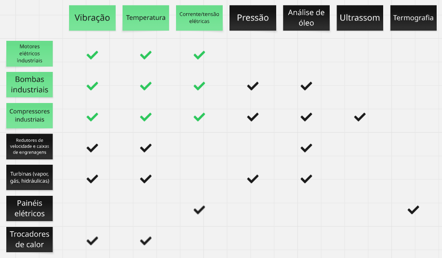
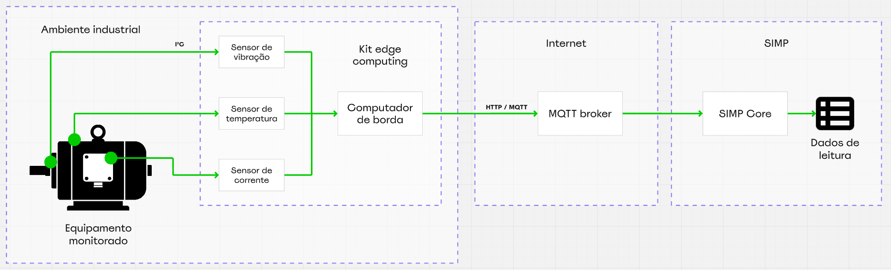
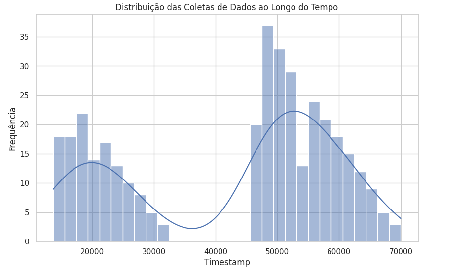

## FIAP - Faculdade de Informática e Administração Paulista

    

 

# Reply - Enterprise Challenge - SIMP - Sistema Inteligente de Manutenção Preditiva
### Sprint 2

## Grupo TiãoTech

## Integrantes
- <a href="https://www.linkedin.com/in/edmilson-marciano-02648a33">Edmilson Marciano</a>
- <a href="https://www.linkedin.com/in/jayromazzi">Jayro Mazzi Junior</a>
- <a href="https://www.linkedin.com/in/leocamacho">Leonardo Camacho</a>
- <a href="https://www.linkedin.com/in/lucas-a-5b7a70110">Lucas Arcanjo</a> 

## Professores
### Tutor(a) 
- <a href="https://www.linkedin.com/in/lucas-gomes-moreira-15a8452a">Lucas Gomes Moreira</a>
### Coordenador(a)
- <a href="https://www.linkedin.com/in/andregodoichiovato">Andre Godoi Chiovato</a>

---

## Objetivo

Para esta entrega, o objetivo é conceber e desenvolver uma prova de conceito que contemple as seguintes funcionalidades:
- Aquisição simulada de dados de múltiplos sensores de aplicação industrial
- Envio de dados para processamento, via HTTP / MQTT
- Formatação dos dados para análise
- Análise exploratória dos dados combinados
- Exibição de gráficos de análise

Como POC, algumas premissas foram adotadas, de forma a simplificar e agilizar o desenvolvimento, dado o tempo reduzido disponível, a saber:

- Desenvolvimento de APIs para isolar os ambientes de aquisição, armazenamento, processamento e consumo de dados.
- Uso de banco de dados, para armazenar as leituras e quaisquer outros dados.
- GUI aperfeiçoada, usando Stremlit ou similar.

## O contexto industrial e a escolha dos sensores

No que diz respeito ao monitoramento de equipamentos industriais, há uma variedade de sensores que podem ser aplicados. Dependendo obviamente do tipo de equipamento que desejamos monitorar e portanto das grandezas envolvidas, alguns tipos são mais adequados que outros. 
Listamos a seguir alguns dos tipos de sensores mais largamente utilizados no setor industrial e os equipamentos aos quais normalmente se aplicam:

*
Tipos de sensores e aplicações de monitoramento mais comuns.
*

## Solução genérica

Considerando que nossa solução, pelo menos até este momento, tem por objetivo atender a uma necessidade genérica, optamos por adotar tipos de sensores que apresentem maior versatilidade de aplicação, assinalados em verde na figura anterior. Da mesma maneira, optamos por um cenário igualmente genérico, que represente uma aplicação industrial comum, a saber, o monitoramento de um motor elétrico, presente em um sem-número de equipamentos industriais.

## Combinação de sensores

O monitoramento de equipamentos baseia-se em dados. Eles são a fonte primária de informações que vão viabilizar a geração de insights para tomada de decisões. Adotamos para este projeto a premissa de que a combinação dos sinais de diferentes tipos de sensores pode enriquecer a análise e revelar nuances e tendências relevantes para a predição de eventos e sugerir medidas preventivas.

## Sensores selecionados

Para o cenário proposto, escolhemos como espinha dorsal do nosso sistema preditivo os tipos de sensores relacionados a seguir:

- **Vibração** - Pode detectar desbalanceamento, desalinhamento, fixação deficiente, folgas e defeitos no rotor ou mesmo no estator.
- **Temperatura** - Aumento de temperatura pode indicar sobrecarga elétrica, problemas de ventilação, superaquecimento de elementos móveis ou rotativos devido a atrito excessivo etc.
- **Corrente/tensão elétrica** - Monitora a eficiência do motor, desbalanceamento de fases, problemas de isolamento e sobrecargas. Variações na corrente podem ser um sintoma precoce de falhas elétricas ou mecânicas que causam maior consumo de energia.

Uma visão combinada desses dados pode apontar problemas de forma mais específica. Exemplo: um rolamento, entrando em estágio adiantado de desgaste, experimenta um padrão acentuado de vibração transversal (x e y no sensor). Devido ao desgaste, há um aumento do atrito entre os componentes do rolamento, elevando a temperatura do conjunto e também a um esforço maior do motor para manter a sua rotação nominal, aumentando a demanda de corrente. A análise conjunta desses fenômenos poderia detectar a tendência de uma falha iminente do rolamento, disparando os devidos alertas.

*
Visão geral da configuração do SIMP nesta POC.
*

## Sensores simulados

A simulação do kit de edge computing será feita no Wokwi, utilizando-se os seguintes sensores:

- **Vibração** - Acelerômetro MPU6050 
- **Temperatura** - Sensor digital de temperatura DS18B20
- **Corrente** - Potenciômetro

Durante a simulação, deve-se manipular os controles do sensor (sliders), para modificar os valores de leitura.

*
Circuito de simulação do edge computer no Wokwi.
*

## Pipeline de dados

Para esta POC, o fluxo de dados adotado é mostrado na figura a seguir:

*
Fluxo de dados desta POC.
*

## Aplicação principal

Para o processamento das leituras, desenvolvemos um script em Python (src/sensor_reader.py) cuja função principal é de conectar o broker MQTT, assinar o tópico relativo às leituras e recebê-las de forma síncrona à sua geração no simulador.
Lendo as colunas "timestamp", "deviceid" e "sensors" que apresentam os dados de "vibration", "temperature" e "current_voltage" 

Os dados simulados são então armazenados em um arquivo CSV (data_inception/vibration_data.csv).

## Exemplo de gráfico

*
Exemplo de gráfico.
*

---

### Estrutura de pastas

Dentre os arquivos e pastas presentes na raiz do projeto, definem-se:

- <b>.github</b>: arquivos de configuração específicos do GitHub.

- <b>assets</b>: imagens.

- <b>documents</b>: documentos de projeto.

- <b>README.md</b>: este documento.

*Foram removidas as pastas default vazias.*

### Licença

<a property="dct:title" rel="cc:attributionURL" href="https://github.com/agodoi/template">MODELO GIT FIAP</a> por <a rel="cc:attributionURL dct:creator" property="cc:attributionName" href="https://fiap.com.br">Fiap</a> está licenciado sobre <a href="http://creativecommons.org/licenses/by/4.0/?ref=chooser-v1" target="_blank" rel="license noopener noreferrer" style="display:inline-block;">Attribution 4.0 International</a>.

