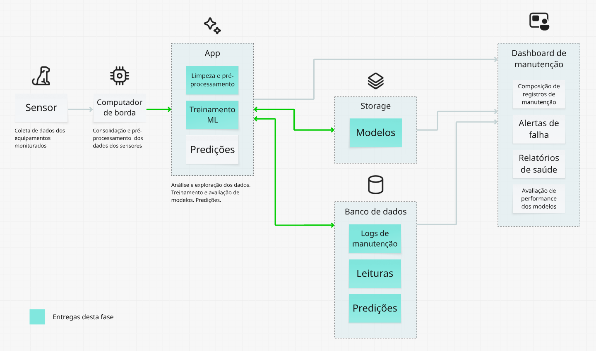
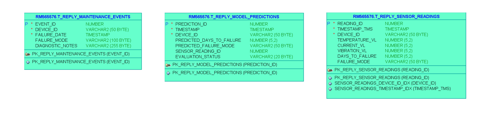
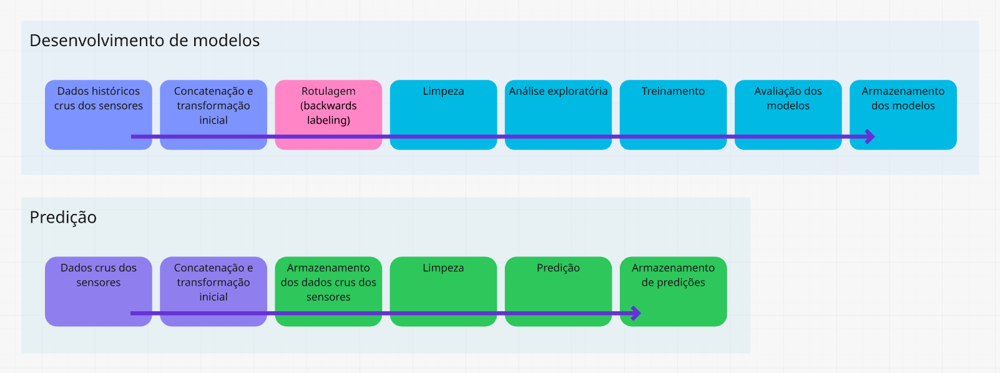
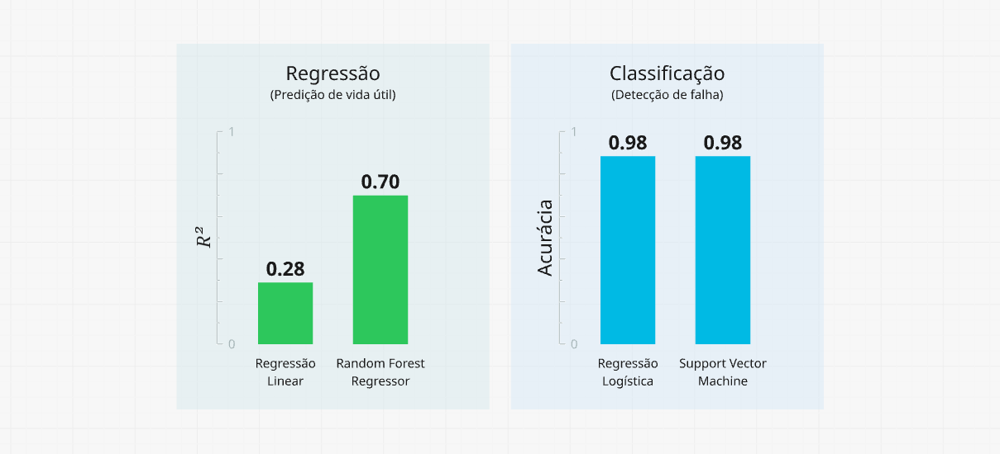

## FIAP - Faculdade de Informática e Administração Paulista

<p style="padding-top: 40px">
    <a href= "https://www.fiap.com.br/">
        
    </a>
</p>

<br>

# Reply - Enterprise Challenge - SIMP - Sistema Inteligente de Manutenção Preditiva
### Sprint 3

## Grupo TiãoTech

<p style="padding-top: 10px;">
    
</p>

## Integrantes
- <a href="https://www.linkedin.com/in/edmilson-marciano-02648a33">RM565912 - Edmilson Marciano</a>
- <a href="https://www.linkedin.com/in/jayromazzi">RM565576 - Jayro Mazzi Junior</a>
- <a href="https://www.linkedin.com/in/lucas-a-5b7a70110">RM563353 - Lucas Arcanjo</a>
- <a href="https://www.linkedin.com/in/vinicius-andrade-01208822b">RM564544 - Marcus Vinicius de Andrades Silva Malaquias</a>

## Professores
### Tutor(a) 
- <a href="https://www.linkedin.com/in/lucas-gomes-moreira-15a8452a">Lucas Gomes Moreira</a>
### Coordenador(a)
- <a href="https://www.linkedin.com/in/andregodoichiovato">Andre Godoi Chiovato</a>


## Objetivos desta entrega

* **1 - Modelagem de banco de dados** - Propor uma modelagem de banco de dados funcional e normalizada, adequada para armazenar os dados coletados pelos sensores.
* **2 - Modelo de Machine Learning** - Criar um modelo simples de Machine Learning, utilizando os dados gerados na entrega anterior (ou dados simulados).

## Vídeo explicativo

> - [FIAP / Reply - Sprint 3](https://www.youtube.com/watch?v=1H88-qi-KX8)


## Premissas

### Foco no aprendizado
Em termos gerais, a principal diretriz foi conservar o caráter da prática das técnicas de modelagem de IA e de bases de dados, de forma a fixar o conhecimento e preparar-se para o exercício profissional, desenvolvendo o espírito investigativo e de melhoria contínua nas entregas.

## Uso de dados simulados
Apesar da nossa busca intensiva por datasets que representassem de forma adequada nosso problema, terminamos por criar um script para geração de um dataset simulado, que será descrito mais adiante.

### Visão conceitual da solução
<br>


*<center><sub>Visão geral simplificada da arquitetura</sub></center>*

#### Observação
As entregas desta fase, destacadas na figura acima, estão listadas no item **Entregáveis e localização**, no final deste documento.

## 1 - Modelagem de banco de dados

Dados, sabemos, são a base das soluções de IA. Para mantê-los, o desenvolvimento de um banco de dados bem estruturado logo de início é crucial para o sucesso dessas soluções a longo prazo. Vamos lidar com diferentes tipos e volumes de dados e, a maneira como eles serão armazenados impacta diretamente o desempenho e a escalabilidade do sistema em questão.

### Diagrama Entidade-Relacionamento
<br>


*<center><sub>Diagrama Entidade-Relacionamento</sub></center>*

### Relacionamentos implícitos (loose coupling)

As tabelas criadas não têm uma chave estrangeira direta, pois a ligação entre elas é feita por meio de uma lógica na aplicação que usa o `DEVICE_ID` e o `FAILURE_DATE` para unir os dados de forma retrospectiva. Esta abordagem flexível permite a retroalimentação contínua do sistema.


*<center><sub>Relacionamento implícito entre tabelas</sub></center>*

### Descrição das tabelas e campos

#### `T_REPLY_SENSOR_READINGS`

Tabela para as leituras coletadas dos sensores em campo, agregadas em uma série temporal pelo computador de borda. Serve de fonte primária para a análise de séries temporais e como conjunto de características (*features*) para os modelos preditivos.

| Campos |  |
|---:|---|
| `ID` | `(PK)` Identificador único para cada leitura. Gerado por uma sequência. |
| `TIMESTAMP` | `(DATETIME)` Momento exato da agregação da leitura. |
| `DEVICE_ID` | `(VARCHAR)` Identificador do equipamento monitorado. |
| `TEMPERATURE_C` | `(NUMBER)` Leitura de temperatura, em °C. |
| `CURRENT_AMPS` | `(NUMBER)` Leitura de corrente elétrica, em A. |
| `VIBRATION_RMS_G` | `(NUMBER)` Leitura de vibração, em g (aceleração). |
| `DAYS_TO_FAILURE` | `(NUMBER)` Variável *target* para os modelos de regressão. Inicialmente, terá valor nulo e populada posteriormente a partir de registros de manutenção. |
| `FAILURE_MODE` | `(VARCHAR)` Variável *target* para os modelos de classificação. Status do equipamento monitorado. Inicialmente, terá valor nulo e populada posteriormente a partir de registros de manutenção. |

#### `T_REPLY_MAINTENANCE_EVENTS`

Tabela para os registros históricos de manutenção, fonte para rotulagem retrospectiva¹. Armazena os registros de manutenção e falhas, que são a *fonte da verdade* para a criação das labels preditivas,
fornecendo os timestamps e as causas das falhas e permitindo que a aplicação gere as labels `DAYS_TO_FAILURE` e `FAILURE_MODE` na tabela `T_REPLY_SENSOR_READINGS`

| Campos |  |
|---:|---|
| `EVENT_ID` | `(PK)` Identificador único para cada evento. Gerado por uma sequência. |
| `DEVICE_ID` | `(VARCHAR)` Identificador do equipamento monitorado. |
| `FAILURE_DATE` | `(DATETIME)` Data e hora do registro do evento. |
| `FAILURE_MODE` | `(VARCHAR)` Status registrado do equipamento monitorado. |
| `DIAGNOSTIC_NOTES` | `(VARCHAR)` Notas técnicas adicionais de manutenção. |

#### `MODEL_PREDICTIONS`

Tabela para o armazenamento das predições. Permite manter uma separação entre uma base comparativa, que viabiliza a real avalição dos modelos ao longo do tempo, por meio do registro de falsos positivos ou negativos.

| Campos |  |
|---:|---|
| `PREDICTION_ID` | `(PK)` Identificador único para cada evento. Gerado por uma sequência. |
| `TIMESTAMP` | `(DATETIME)` Momento exato em que a predição foi gerada. |
| `DEVICE_ID` | `(VARCHAR)` Identificador do equipamento monitorado. |
| `PREDICTED_DAYS_TO_FAILURE` | `(NUMBER)` Predição da vida útil restante do componente. |
| `PREDICTED_FAILURE_MODE` | `(VARCHAR)` Predição do estado do equipamento ('normal' ou 'em falha'). |
| `SENSOR_READING_ID` | `(NUMBER)` Identificador da leitura do sensor que gerou esta predição. Liga a predição à tabela `T_REPLY_SENSOR_READINGS`. |
| `EVALUATION_STATUS` | `(VARCHAR)` Status da avaliação da predição (ex: 'verdadeiro positivo', 'falso negativo', 'não avaliado'). |

¹ - <sub>Veja [A fonte da verdade - Dados puros e os registros de manutenção](#a-fonte-da-verdade---dados-puros-e-os-registros-de-manutenção), adiante neste documento.</sub>

### Fluxo de dados


*<center><sub>Fluxo de dados</sub></center>*

### Restrições de integridade

A escolha dos tipos de dados e seus tamanhos foi guiada por princípios de integridade dos dados, otimização de armazenamento e performance. Cada tipo foi selecionado para garantir que os dados sejam armazenados de forma precisa e que o banco de dados possa operar de maneira eficiente a longo prazo.
Houve uma preocupação em *economizar* no que diz espeito ao tamanho dados dados, adotando-se sempre o mínimo necessário para acomodar adequadamente o dado correspondente (ex.: `EVALUATION_STATUS`-`VARCHAR(20 BYTE`) e `DIAGNOSTIC_NOTES`-`VARCHAR(255 BYTE)`).

### Integração com visualização de dados

A integração com ferramentas de visualização de dados abre um leque de possibilidades para acompanhar a saúde dos equipamentos e a performance dos modelos. Algumas ideias:
> - **Gráfico de linha em tempo real**<br>
Permite companhar a evolução dos valores de temperatura, corrente e vibração ao longo do tempo. Um esquema adequado de cores pode ajudar a identificar a mudança do status dos equipamentos.
> - **Matriz de confusão acumulada**<br>
Gráfico de pizza que mostra os valores acumulados de `Falsos Positivos` e `Verdadeiros Positivos`, mostrando de forma dinâmica o comportamento dos modelos.
> - **Histogrma de distribuição das predições de vida útil**<br>
Permite melhorar a programação de manutenções preventivas, a partir da visualização da quantidade de dias comumente prevista antes de uma falha.

Podemos pensar em inúmeras outras possibilidades de visualização que entreguem real valor aos suários, todas utilizando os dados do nosso banco.
Um dashboard dessa natureza poderia ser rapidamente construída utilizando-se o Stremlit. Ele apresenta vantagens como prototipgem rápida, integração facilitada e nativa com Python, controle total sobre o desenho da interface gráfica, além de ser ideal para um MVP.


## 2 - Modelo de Machine Learning

### Dados iniciais simulados
Os dados simulados foram criados a partir de um script Python. Algumas características desses dados:
> - Simulam o monitoramento de dois motores industriais idênticos.
> - Incluem dados por um período de 60 dias, com uma medição a cada 10 minutos.
> - Simulam uma falha progressiva em um dos equipamentos, a partir de 30 dias antes da falha total. O outro equipamento operará normalmente durante todo o período e servirá de linha de base.

O script para geração dos dados encontra-se em src/data_generation.ipynb.

### Pré-processamento inicial
Os dados simulados não representam os dados crus coletados dos sensores. Em vez disso, eles recebem um primeiro tratamento, ou agregação em série temporal, já no computador de borda. Essa agregação sincroniza os dados dos sensores, combinados em um único pacote, em formato adequado para o envio.
Como a frequência de leitura dos sensores pode ser diferente, o computador de borda efetua uma média, de forma a obter um valor único por sensor a cada intervalo definido (no nosso caso, 10 minutos).
Os dados numéricos são formatados, para diminuir o volume enviado.

### A *fonte da verdade* - Dados puros e os registros de manutenção
Os dados que serão posteriormente utilizados para o treinamento dos modelos não são os dados puros recebidos do computador de borda e sim os registros enriquecidos de manutenção. Para compor esses registros e prepará-los para o treinamento de modelos, houve a intervenção de um engenheiro de dados que, a partir da ocorrência de uma falha, avaliou os dados históricos que levaram a ela, para identificar o início do comportamento anômalo causador da falha. Observe a imagem a seguir:


*<center><sub>Timeline da falha</sub></center>*

Eis a sequência:

> 1. Ocorre a falha
> 2. Um técnico de manutenção registra o evento. Esse registro contém o dia e horário exatos da ocorrência e o motivo (ex.: desgaste do rolamento, bobina do estator em curto etc.).
> 3. Com base nesses registros, o cientista de dados ou equivalente vai investigar o sinal dos sensores para identificar o início dos sinais anômalos e, feito isso, irá proceder à rotulagem dos dados que antecederam a falha (ou backwards labeling), para que eles contenham a informação adicional da quantidade de dias para a ocorrência da falha (days_to_failure) e o status (failure_mode).

Esse processo deverá ser repetido para cada falha registrada. Isso permitirá que se construa um dataset completo e rotulado ao longo do tempo e que esses dados sejam a ***fonte de verdade*** para o treinamento dos modelos.


*<center><sub>Fluxo de dados para treinamento e para predição</sub></center>*

### Escolha da abordagem
Analisando detidamente o problema que estamos tentando resolver, ou seja, a predição de falhas em equipamentos industriais, percebemos que, embora sugira ser um simples problema de regressão, já que estamos analisando variáveis numéricas para determinar a quantidade de dias para falha ( ```days-to-failure``` ). Por outro lado, tratamos também de determinar o valor para uma categoria discreta ( ```failure_mode``` ), com o objetivo de determinar o estado do equipamento (normal ou anômalo), o que configuraria um problema de classificação.
 
Ao abraçar esses dois desafios, colocamo-nos diante de uma **abordagem híbrida**, com uma componente de classificação, para a emissão de alertas, e outra de regressão, para a construção de um prognóstico.

### Exploração dos dados

Todo o trabalho de preparação dos dados aqui comentado foi desenvolvido no notebook [sprint_3/src/reply_3_app.ipynb](src/reply_3_app.ipynb).

Apesar de já termos uma forte noção das características dos dados adotados, por serem dados simulados, ainda assim e em nome da prática didática, realizamos a busca por dados ausentes e por duplicatas. Obviamente, os dados se mostraram bastante comportados nesse sentido. 
Já, tanto a verificação de outliers, como da correlação entre variáveis, levantaram alguns pontos de reflexão, discutidos a seguir.

#### Investigação de outliers

A verificação de outliers revelou uma quantidade considerável de outliers. 
Diante disso e observando visualmente o comportamento dos dados, levantamos a hipótese de que os outliers encontrados referem-se justamente àqueles dados portadores das informações de anomalia que estamos buscando. Por isso, passamos a investigar essa possibilidade.


*<center><sub>Comportamento dos dados</sub></center>*

Filtramos o dataset, mantendo apenas os dados do equipamento que não apresentou falha e geramos um novo boxplot. Como resultado, verificamos a diminuição bastante acentuada dos outliers, o que nos levou a considerar verdadeira a nossa hipótese, **mantendo os outliers para treinamento dos modelos**.


*<center><sub>Outliers em dados com e sem falhas</sub></center>*

Via de regra, outliers são dados legítimos e portanto importantes para o problema. Eles representam um problema quando indicam uma falha nítida dos dados, um erro claro de coleta. Já quando o objetivo principal é detectar anomalias em situações como a nossa, ou seja, falhas em equipamentos, os outliers podem ser exatamente os dados que procuramos, pois carregam a informação da anomalia e, nesse caso, devem ser preservados.

Outliers são nocivos quando há a possibilidade de uma falha de leitura, de registro dos dados ou quando representam uma variável desconhecida e desconsiderada, ainda que importante. Por outro lado, são benéficos e necessários quando nos ajudam a compreender o comportamento dos dados de forma legítima (veja o artigo [The impact of outliers on Data: when to remove and when to retain](https://medium.com/@abhaysingh71711/the-impact-of-outliers-on-data-when-to-remove-and-when-to-retain-fb6e474ddbd8)).


#### Correlação de variáveis

Além do heatmap da matriz de correlação (abaixo), a mera observação visual dos dados já sugere uma alta correlação entre as variáveis, especialmente no período que antecede a falha.


*<center><sub>Heatmap da matriz de correlação das variáveis</sub></center>*

A própria lógica da ocorrência de uma falha em um equipamento rotativo sugere essa correlação:
> - À medida que os componentes de um motor, por exemplo, se desgastam, é esperado que o atrito entre as peças móveis aumente. 
> - Esse atrito extra gera calor, o que faz com que a temperatura do componente aumente.
> - Ao mesmo tempo, o atrito e o desgaste geram um aumento na vibração, que se manifesta como picos e um aumento no valor RMS. 
> - Motores industriais síncronos de corrente alternada (os mais comuns) têm rotação constante, sincronizada à frequência da rede elétrica. Para manter a rotação numa situação de atrito elevado, acabam por aumentar o torque necessário, exigindo mais corrente da rede elétrica. 

Logo, maior desgaste, maior vibração, maior atrito, maior temperatura e mais corrente, ou seja, as variáveis se comportam de forma muito semelhante.

Há diversos motivos para querermos remover variáveis de alta correlação (veja, por exemplo, o artigo [Why we have to remove highly correlated features in Machine Learning](https://medium.com/@sujathamudadla1213/why-we-have-to-remove-highly-correlated-features-in-machine-learning-9a8416286f18))   . Elas podem ser nocivas de diversas maneiras e prejudicar os resultados que buscamos.
Ao investigar nossos dados, no entanto, surgiu-nos a hipótese de que o comportamento de alta correlação detectado pode estar ligado ao fato de se tratar de dados simulados. Dados reais, via de regra, não são tão comportados.

Além disso, nem todas as falhas em motores se devem ao desgaste. Podemos imaginar outros exemplos, como rede elétrica deficiente, má fixação dos componentes, acoplamentos desalinhados, desbalanceamento, impactos etc. Diferentes causas podem levar a correlação a outros índices.

De qualquer maneira, os dados, ainda que correlacionados, trazem informações diferentes e mesmo complementares, contam diferentes histórias, levando a um diagnóstico mais rico. 

Expostas essas razões, **optamos por manter as variáveis**, por considerar que a correlação detectada pode ser benéfica e mesmo contextual.

### Modelos adotados

Escolhemos quatro algorítmos para o desenvolvimento dos modelos:

**Modelos de regressão**

> 1. Regressão Linear
> 2. Random Forest Regressor

**Modelos de classificação**
> 3. Regressão Logística
> 4. Support Vector Machine

Como critério para a escolha dos modelos **Regressão Linear** e **Regressão Logística**, consideramos a sua simplicidade e também por se tratar de abordagens lineares. Ambos são modelos baseline, fáceis de treinar e fornecem uma base de comparação fundamental.

Já os modelos **Random Forest Regressor** e **Support Vector Machine** são mais complexos e não lineares. Permitem uma abordagem mais robusta, que permite capturar padrões complexos e não-lineares nos dados.

Mais adiante, poderemos observar os resultados da avaliação dos modelos e tecer algumas considerações.

### Treinamento

Uma vez que nosso dataset esteja devidamente preparado, temos a base adequada para o desenvolvimento dos modelos preditivos, o que nos leva à fase de treinamento.

O objetivo aqui é que nosso modelo possa compreender a história oculta que nossos dados nos contam e aprender a identificar os padrões sutis que levam a uma falha futura.


*<center><sub>Treinamento de modelos</sub></center>*

Nossa estratégia de treinamento dos modelos foi dividida em duas frentes para resolver o problema de manutenção preditiva de forma abrangente:

> 1. Primeiro, um modelo de classificação (Regressão Logística e SVM) foi treinado para a tarefa de **detecção de falha**, ou seja, para classificar o estado do motor (```failure_mode```) em ```normal``` ou ```failure_in_progress``` com base nas leituras dos sensores. 
> 2. Em seguida, um modelo de regressão (Regressão Linear e Random Forest Regressor) foi treinado para a tarefa de **prognóstico**, prevendo o valor contínuo de 'dias para a falha' (```days_to_failure```) quando a detecção de falha já tiver sido feita. 

Essa abordagem dupla garante que o sistema não apenas alerte sobre uma falha iminente, mas também forneça um prognóstico preciso da vida útil restante do componente.

### Análise Comparativa dos Modelos

A estratégia de utilizar diferentes tipos de modelos para as tarefas de regressão e classificação nos permitiu não apenas resolver o problema, mas também compreender a natureza dos nossos dados. Os resultados obtidos revelaram que a complexidade do problema exige abordagens não-lineares, validando a nossa escolha de modelos mais robustos.


*<center><sub>Comparação dos modelos - Métricas</sub></center>*


#### Modelos de Regressão - Previsão da Vida Útil Restante

O desempenho dos modelos de regressão, medido pelo **Coeficiente de Determinação ($R²$)**, mostrou uma diferença significativa:

* **Regressão Linear** - Apresentou um $R²$ de **0.28**, um valor considerado baixo. Este resultado indica que o modelo de regressão linear foi capaz de explicar apenas 28% da variabilidade dos dias até a falha. Isso sugere que a relação entre as leituras dos sensores e o tempo para a falha não é linear, o que era esperado em um processo físico complexo como a degradação de um motor.

* **Random Forest Regressor** - Demonstrou um desempenho substancialmente superior, com um $R²$ de **0.70**. Este valor significa que o modelo explica 70% da variabilidade dos dados. O sucesso do Random Forest Regressor comprova que ele foi capaz de capturar as relações não-lineares e os padrões complexos inerentes ao problema. Para a nossa solução de prognóstico, o Random Forest é claramente a melhor escolha.

#### Modelos de Classificação: - Detecção de Falhas

A tarefa de classificação, que visa determinar se o motor está em estado 'Normal' ou 'Em Falha', foi abordada com sucesso por ambos os modelos.

* **Regressão Logística e Support Vector Machine (SVM)** - Ambos os modelos atingiram uma **alta acurácia**, indicando que conseguiram classificar corretamente a grande maioria dos casos. No entanto, para uma análise mais detalhada, é essencial olhar para a **Matriz de Confusão**, abaixo.


*<center><sub>Matrizes de confusão para os modelos de classificação</sub></center>*

A matriz de confusão nos permite identificar os tipos de erros. No contexto de manutenção preditiva, os **Falsos Negativos** (quando o modelo prevê 'Normal', mas a falha é real) são o pior tipo de erro, pois podem levar a falhas catastróficas. Por outro lado, os **Falsos Positivos** (um alerta falso) são menos críticos, mas podem causar custos desnecessários com inspeções. A análise da matriz de confusão de ambos os modelos mostrou que eles minimizam de forma eficaz os Falsos Negativos, tornando-os excelentes candidatos para a nossa solução de detecção.

A análise comparativa valida a nossa estratégia de utilizar modelos de Machine Learning distintos. A abordagem híbrida, combinando um modelo de classificação (como SVM ou Regressão Logística) para a detecção de falha e um modelo de regressão robusto (Random Forest) para o prognóstico da vida útil restante, é a mais eficaz. Ela nos permite construir uma solução completa, que não só alerta para uma falha iminente, mas também fornece um prazo acionável para a manutenção.

### Predições

Submetemos alguns exemplos de leituras aos modelos para obter suas predições. Desses testes, destacamos uma das predições, que nos provoca um ponto de reflexão. Eis os resultados:
```
Dados puros
    [[55.   7.5  0.8  1.   0. ]]

Dados de leitura
    - Temperatura: 55.0 °C
    - Corrente: 7.5 A
    - Vibração: 0.8 g
    - Dispositivo: motor_1

Dados padronizados
    [[ 1.9   1.26  0.96  1.   -1.  ]]

Predições
    - Vida Útil Restante (RF Regressor): 18.43 dias
    - Classificação (Regressão Logística): o estado do motor é 'normal'

```

O exemplo nos traz informações importantes:

#### Validação da abordagem híbrida

O exemplo mostra os dois modelos trabalhando em conjunto. O modelo de Regressão Logística dá o parecer primário ("o estado do motor é 'normal'"), enquanto o modelo de Random Forest fornece uma predição numérica ("18.43 dias"). Essa dualidade de resultados valida a nossa estratégia de usar um modelo para cada tipo de problema. 

#### A Inconsistência lógica

O exemplo deixa evidente que há uma incongruência lógica nas predições. Ora, se o motor está normal, ele não deveria ter uma vida útil curta. A predição do modelo de regressão só faria sentido se o modelo de classificação tivesse indicado um motor em falha. Isso aponta para a realidade de que os modelos, apesar de fornecerem diagnósticos complementares, foram construídos e trabalham de forma independente, o que pode levar a tais discrepâncias. 

Este exemplo, em vez de ser um problema, é uma prova de que a arquitetura de sistema de dois passos é a mais adequada para o problema de manutenção preditiva. Ele aponta para a necessidade da integração prática dos modelos, não apenas sobre o seu treinamento.

Essa integração deve obedecer a uma lógica de negócio, presente na própria lógica da aplicação. Dessa forma, os dados seriam submetidos à regressão, **apenas** se a classificação detectar uma falha, evitando assim, predições inconsistentes.

Além disso, não podemos deixar de mencionar que o desenvolvimento de modelos de sucesso não é uma atividade linear. Ao contrário, é fruto de um processo iterativo de melhoria contínua, ao longo de erros, ajustes, hipóteses falhas etc., até que tenhamos resultados satisfatórios.

## Conclusão

A jornada de aprendizado neste projeto nos mostrou que IA e Ciência de Dados são um exercício de decisões fundamentadas.

Contrariando práticas comuns, preferimos o atrevimento de manter outliers e variáveis altamente correlacionadas, pois nossa investigação revelou que, para este contexto, eles não são ruído, mas sim sinais valiosos que enriquecem os modelos. 

Da mesma forma, em vez de simplificar o problema, optamos por uma abordagem híbrida de IA, combinando modelos de classificação para a detecção de alertas e de regressão para o prognóstico de falhas. 

Essa estratégia, embora mais complexa, permitiu-nos exercitar o desenvolvimento de uma solução diferenciada, que reflete nossa premissa de ir além do convencional, enfrentando os desafios do problema real com um espírito de exploração e melhoria contínua.

**Grupo TiãoTech**

---

## Entregáveis

### Vídeo explicativo

> - [FIAP / Reply - Sprint 3](https://www.youtube.com/watch?v=1H88-qi-KX8)

### Banco de dados

> - **Script para criação das tabelas**<br />
[sprint_3/database/reply_3_model.sql](database/reply_3_model.sql)
> - **Diagrama ER**<br />
[sprint_3/assets/reply_3_DER.png](assets/reply_3_DER.png)
> - **Documentação adicional**<br />
[sprint_3/database/reply_3.dmd](database/reply_3.dmd)<br />
[sprint_3/database/reply_3](database/reply_3)

### Modelo de Machine Learning

> - **Notebook da aplicação para treinamento dos modelos**<br />
[sprint_3/src/reply_3_app.ipynb](src/reply_3_app.ipynb)
> - **Dados originais simulados do computador de borda**<br />
[sprint_3/sensor_data/simulated_sensor_data.csv](sensor_data/simulated_sensor_data.csv)
> - **Modelos treinados**<br />
[sprint_3/trained_models](trained_models)
> - **Gráficos ou prints dos resultados obtidos com o modelo**<br />
Tanto o [notebook da aplicação](src/reply_3_app.ipynb), quanto o presente documento estão amplamente ilustrados com os gráficos e prints relacionados ao desenvolvimento e teste dos modelos.

## Como rodar o projeto

Para o treinamento dos modelos e visualização dos artefatos:
> - Suba o [arquivo de dados](sensor_data/simulated_sensor_data.csv) no Colab.
> - Execute o [notebook da aplicação](src/reply_3_app.ipynb) no Colab.

Para a criação das tabelas:
> - Utilize o [script para construção das tabelas](database/reply_3_model.sql) na sua aplicação ².

² - <sub>Utilizamos o Oracle SQL developer para criação do nosso banco de dados. Logo, algumas instruções podem seguir uma sintaxe diferenciada e seu comportamento pode não ser compatível com outras aplicações de bancos de dados.</sub>


---

### Estrutura de pastas

Dentre os arquivos e pastas presentes na raiz do sprint 3, definem-se:

- **assets**: imagens.

- **database**: documentação do banco de dados.

- **sensor_data**: Dados simulados.

- **src**: Código fonte da aplicação

- **trained_models**: Modelos de ML treinados

- **README.md**: este documento.

*Foram removidas as pastas default vazias.*

### Licença

<p xmlns:cc="http://creativecommons.org/ns#" xmlns:dct="http://purl.org/dc/terms/"><a property="dct:title" rel="cc:attributionURL" href="https://github.com/agodoi/template">MODELO GIT FIAP</a> por <a rel="cc:attributionURL dct:creator" property="cc:attributionName" href="https://fiap.com.br">Fiap</a> está licenciado sobre <a href="http://creativecommons.org/licenses/by/4.0/?ref=chooser-v1" target="_blank" rel="license noopener noreferrer" style="display:inline-block;">Attribution 4.0 International</a>.</p>


