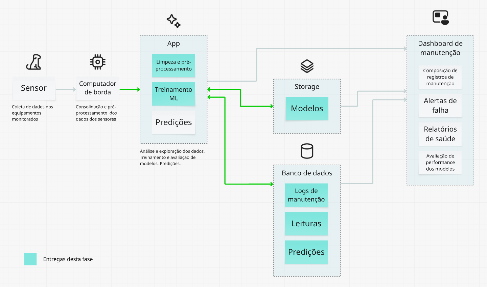
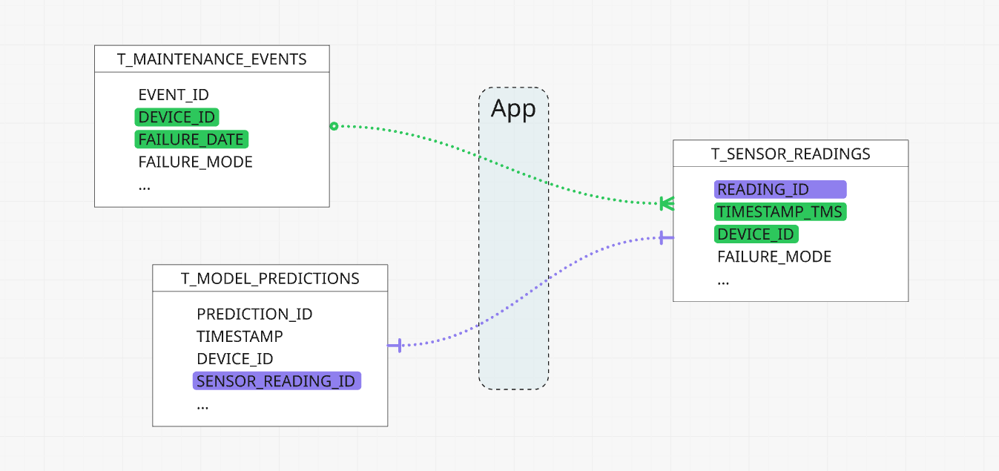
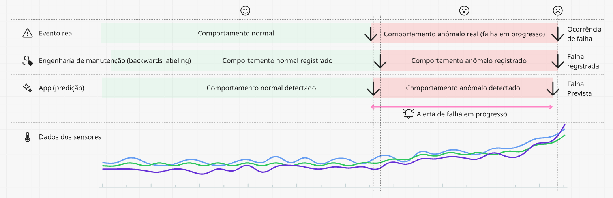
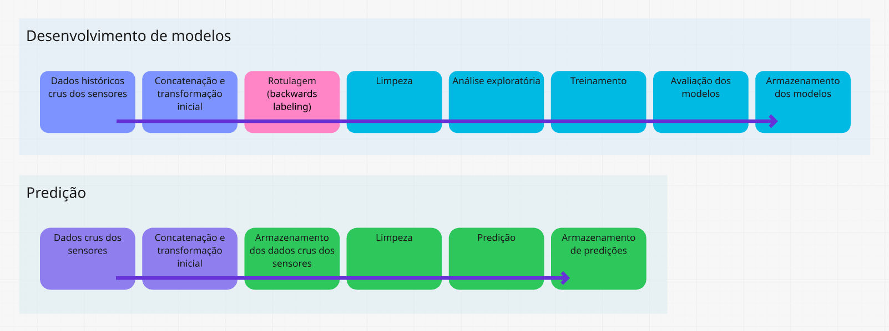
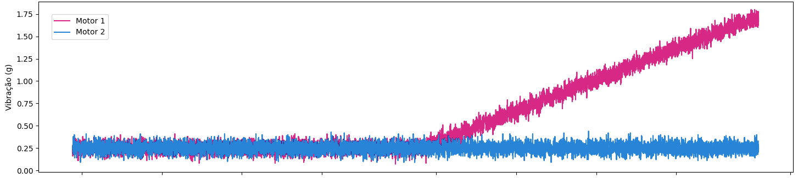
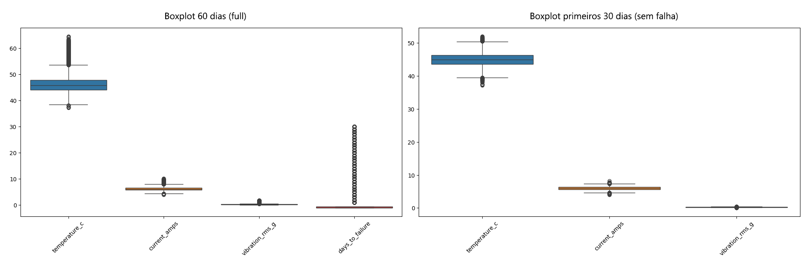
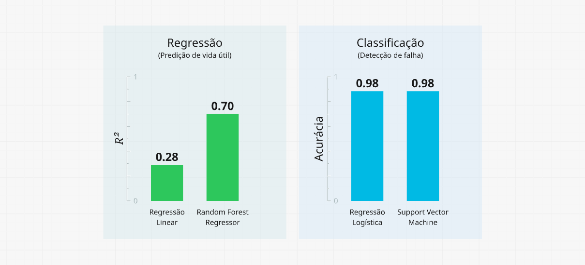
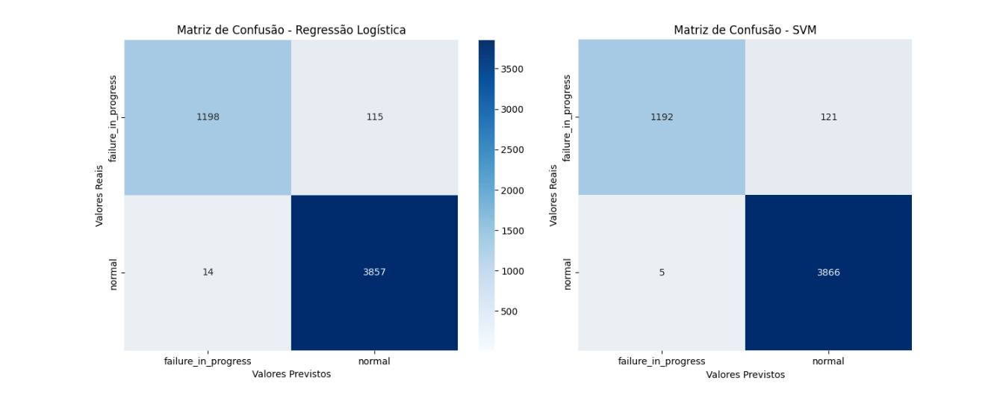

## FIAP - Faculdade de Informática e Administração Paulista

<p style="padding-top: 40px">
    <a href= "https://www.fiap.com.br/">
        
    </a>
</p>

<br>

# Reply - Enterprise Challenge - SIMP - Sistema Inteligente de Manutenção Preditiva
### Sprint 3


## Grupo TiãoTech

## 👨‍🎓 Integrantes
- <a href="https://www.linkedin.com/in/edmilson-marciano-02648a33">RM565912 - Edmilson Marciano</a>
- <a href="https://www.linkedin.com/in/jayromazzi">RM565576 - Jayro Mazzi Junior</a>
- <a href="https://www.linkedin.com/in/lucas-a-5b7a70110">RM563353 - Lucas Arcanjo</a>
- <a href="https://www.linkedin.com/in/vinicius-andrade-01208822b">RM564544 - Marcus Vinicius de Andrades Silva Malaquias</a>

## 👩‍🏫 Professores
### Tutor(a) 
- <a href="https://www.linkedin.com/in/lucas-gomes-moreira-15a8452a">Lucas Gomes Moreira</a>
### Coordenador(a)
- <a href="https://www.linkedin.com/in/andregodoichiovato">Andre Godoi Chiovato</a>

## 


## Objetivos desta entrega

* **1 - Modelagem de banco de dados** - Propor uma modelagem de banco de dados funcional e normalizada, adequada para armazenar os dados coletados pelos sensores.
* **2 - Modelo de Machine Learning** - Criar um modelo simples de Machine Learning, utilizando os dados gerados na entrega anterior (ou dados simulados).


## Premissas

### Foco no aprendizado
Em termos gerais, a principal diretriz foi conservar o caráter da prática das técnicas de modelagem de IA e de bases de dados, de forma a fixar o conhecimento e preparar-se para o exercício profissional, desenvolvendo o espírito investigativo e de melhoria contínua nas entregas.

## Uso de dados simulados
Apesar da nossa busca intensiva por datasets que representassem de forma adequada nosso problema, terminamos por criar um script para geração de um dataset simulado, que será descrito mais adiante.

### Visão conceitual da solução


*<center><sub>Visão geral simplificada da arquitetura</sub></center>*

#### Observação
As entregas desta fase, destacadas na figura acima, estão listadas no item **Entregáveis e localização**, no final deste documento.


## 1 - Modelagem de banco de dados

### Diagrama Entidade-Relacionamento


*<center><sub>Diagrama Entidade-Relacionamento</sub></center>*


### Descrição das tabelas e campos

### Relacionamentos implícitos (loose coupling)


*<center><sub>Relacionamento implícito entre tabelas</sub></center>*

SSoT - Single Source of Truth

[figura fluxo de dados]

Restrições de integridade (tipos de dados, limites de tamanho etc.);

Integração com visualização de dados


## 2 - Modelo de Machine Learning

### Dados iniciais simulados
Os dados simulados foram criados a partir de um script Python. Algumas características desses dados:
> - Simulam o monitoramento de dois motores industriais idênticos.
> - Incluem dados por um período de 60 dias, com uma medição a cada 10 minutos.
> - Simulam uma falha progressiva em um dos equipamentos, a partir de 30 dias antes da falha total. O outro equipamento operará normalmente durante todo o período e servirá de linha de base.

O script para geração dos dados encontra-se em src/data_generation.ipynb.

### Pré-processamento inicial
Os dados simulados não representam os dados crus coletados dos sensores. Em vez disso, eles recebem um primeiro tratamento, ou agregação em série temporal, já no computador de borda. Essa agregação sincroniza os dados dos sensores, combinados em um único pacote, em formato adequado para o envio.
Como a frequência de leitura dos sensores pode ser diferente, o computador de borda efetua uma média, de forma a obter um valor único por sensor a cada intervalo definido (no nosso caso, 10 minutos).
Os dados numéricos são formatados, para diminuir o volume enviado.

### A *fonte da verdade* - Dados puros e os registros de manutenção
Os dados que serão posteriormente utilizados para o treinamento dos modelos não são os dados puros recebidos do computador de borda e sim os registros enriquecidos de manutenção. Para compor esses registros e prepará-los para o treinamento de modelos, houve a intervenção de um engenheiro de dados que, a partir da ocorrência de uma falha, avaliou os dados históricos que levaram a ela, para identificar o início do comportamento anômalo causador da falha. Observe a imagem a seguir:


*<center><sub>Timeline da falha</sub></center>*

Eis a sequência:

> 1. Ocorre a falha
> 2. Um técnico de manutenção registra o evento. Esse registro contém o dia e horário exatos da ocorrência e o motivo (ex.: desgaste do rolamento, bobina do estator em curto etc.).
> 3. Com base nesses registros, o cientista de dados ou equivalente vai investigar o sinal dos sensores para identificar o início dos sinais anômalos e, feito isso, irá proceder à rotulagem dos dados que antecederam a falha (ou backwards labeling), para que eles contenham a informação adicional da quantidade de dias para a ocorrência da falha (days_to_failure) e o status (failure_mode).

Esse processo deverá ser repetido para cada falha registrada. Isso permitirá que se construa um dataset completo e rotulado ao longo do tempo e que esses dados sejam a ***fonte de verdade*** para o treinamento dos modelos.


*<center><sub>Fluxo de dados para treinamento e para predição</sub></center>*

### Escolha da abordagem
Analisando detidamente o problema que estamos tentando resolver, ou seja, a predição de falhas em equipamentos industriais, percebemos que, embora sugira ser um simples problema de regressão, já que estamos analisando variáveis numéricas para determinar a quantidade de dias para falha ( ```days-to-failure``` ). Por outro lado, tratamos também de determinar o valor para uma categoria discreta ( ```failure_mode``` ), com o objetivo de determinar o estado do equipamento (normal ou anômalo), o que configuraria um problema de classificação.
 
Ao abraçar esses dois desafios, colocamo-nos diante de uma **abordagem híbrida**, com uma componente de classificação, para a emissão de alertas, e outra de regressão, para a construção de um prognóstico.

### Exploração dos dados

Todo o trabalho de preparação dos dados aqui comentado foi desenvolvido no notebook [sprint_3/src/reply_3_app.ipynb](src/reply_3_app.ipynb).

Apesar de já termos uma forte noção das características dos dados adotados, por serem dados simulados, ainda assim e em nome da prática didática, realizamos a busca por dados ausentes e por duplicatas. Obviamente, os dados se mostraram bastante comportados nesse sentido. 
Já, tanto a verificação de outliers, como da correlação entre variáveis, levantaram alguns pontos de reflexão, discutidos a seguir.

#### Investigação de outliers

A verificação de outliers revelou uma quantidade considerável de outliers. 
Diante disso e observando visualmente o comportamento dos dados, levantamos a hipótese de que os outliers encontrados referem-se justamente àqueles dados portadores das informações de anomalia que estamos buscando. Por isso, passamos a investigar essa possibilidade.


*<center><sub>Comportamento dos dados</sub></center>*

Filtramos o dataset, mantendo apenas os dados do equipamento que não apresentou falha e geramos um novo boxplot. Como resultado, verificamos a diminuição bastante acentuada dos outliers, o que nos levou a considerar verdadeira a nossa hipótese, **mantendo os outliers para treinamento dos modelos**.


*<center><sub>Outliers em dados com e sem falhas</sub></center>*

Via de regra, outliers são dados legítimos e portanto importantes para o problema. Eles representam um problema quando indicam uma falha nítida dos dados, um erro claro de coleta. Já quando o objetivo principal é detectar anomalias em situações como a nossa, ou seja, falhas em equipamentos, os outliers podem ser exatamente os dados que procuramos, pois carregam a informação da anomalia e, nesse caso, devem ser preservados.

Outliers são nocivos quando há a possibilidade de uma falha de leitura, de registro dos dados ou quando representam uma variável desconhecida e desconsiderada, ainda que importante. Por outro lado, são benéficos e necessários quando nos ajudam a compreender o comportamento dos dados de forma legítima (veja o artigo [The impact of outliers on Data: when to remove and when to retain](https://medium.com/@abhaysingh71711/the-impact-of-outliers-on-data-when-to-remove-and-when-to-retain-fb6e474ddbd8)).


#### Correlação de variáveis

Além do heatmap da matriz de correlação (abaixo), a mera observação visual dos dados já sugere uma alta correlação entre as variáveis, especialmente no período que antecede a falha.


*<center><sub>Heatmap da matriz de correlação das variáveis</sub></center>*


A própria lógica da ocorrência de uma falha em um equipamento rotativo sugere essa correlação:
> - À medida que os componentes de um motor, por exemplo, se desgastam, é esperado que o atrito entre as peças móveis aumente. 
> - Esse atrito extra gera calor, o que faz com que a temperatura do componente aumente.
> - Ao mesmo tempo, o atrito e o desgaste geram um aumento na vibração, que se manifesta como picos e um aumento no valor RMS. 
> - Motores industriais síncronos de corrente alternada (os mais comuns) têm rotação constante, sincronizada à frequência da rede elétrica. Para manter a rotação numa situação de atrito elevado, acabam por aumentar o torque necessário, exigindo mais corrente da rede elétrica. 

Logo, maior desgaste, maior vibração, maior atrito, maior temperatura e mais corrente, ou seja, as variáveis se comportam de forma muito semelhante.

Há diversos motivos para querermos remover variáveis de alta correlação (veja, por exemplo, o artigo [Why we have to remove highly correlated features in Machine Learning](https://medium.com/@sujathamudadla1213/why-we-have-to-remove-highly-correlated-features-in-machine-learning-9a8416286f18))   . Elas podem ser nocivas de diversas maneiras e prejudicar os resultados que buscamos.
Ao investigar nossos dados, no entanto, surgiu-nos a hipótese de que o comportamento de alta correlação detectado pode estar ligado ao fato de se tratar de dados simulados. Dados reais, via de regra, não são tão comportados.

Além disso, nem todas as falhas em motores se devem ao desgaste. Podemos imaginar outros exemplos, como rede elétrica deficiente, má fixação dos componentes, acoplamentos desalinhados, desbalanceamento, impactos etc. Diferentes causas podem levar a correlação a outros índices.

De qualquer maneira, os dados, ainda que correlacionados, trazem informações diferentes e mesmo complementares, contam diferentes histórias, levando a um diagnóstico mais rico. 

Expostas essas razões, **optamos por manter as variáveis**, por considerar que a correlação detectada pode ser benéfica e mesmo contextual.

### Modelos adotados

Escolhemos quatro algorítmos para o desenvolvimento dos modelos:

**Modelos de regressão**

> 1. Regressão Linear
> 2. Random Forest Regressor

**Modelos de classificação**
> 3. Regressão Logística
> 4. Support Vector Machine

Como critério para a escolha dos modelos **Regressão Linear** e **Regressão Logística**, consideramos a sua simplicidade e também por se tratar de abordagens lineares. Ambos são modelos baseline, fáceis de treinar e fornecem uma base de comparação fundamental.

Já os modelos **Random Forest Regressor** e **Support Vector Machine** são mais complexos e não lineares. Permitem uma abordagem mais robusta, que permite capturar padrões complexos e não-lineares nos dados.

Mais adiante, poderemos observar os resultados da avaliação dos modelos e tecer algumas considerações.

### Treinamento

Uma vez que nosso dataset esteja devidamente preparado, temos a base adequada para o desenvolvimento dos modelos preditivos, o que nos leva à fase de treinamento.

O objetivo aqui é que nosso modelo possa compreender a história oculta que nossos dados nos contam e aprender a identificar os padrões sutis que levam a uma falha futura.


*<center><sub>Treinamento de modelos</sub></center>*

Nossa estratégia de treinamento dos modelos foi dividida em duas frentes para resolver o problema de manutenção preditiva de forma abrangente:

> 1. Primeiro, um modelo de classificação (Regressão Logística e SVM) foi treinado para a tarefa de **detecção de falha**, ou seja, para classificar o estado do motor (```failure_mode```) em ```normal``` ou ```failure_in_progress``` com base nas leituras dos sensores. 
> 2. Em seguida, um modelo de regressão (Regressão Linear e Random Forest Regressor) foi treinado para a tarefa de **prognóstico**, prevendo o valor contínuo de 'dias para a falha' (```days_to_failure```) quando a detecção de falha já tiver sido feita. 

Essa abordagem dupla garante que o sistema não apenas alerte sobre uma falha iminente, mas também forneça um prognóstico preciso da vida útil restante do componente.

### Análise Comparativa dos Modelos

A estratégia de utilizar diferentes tipos de modelos para as tarefas de regressão e classificação nos permitiu não apenas resolver o problema, mas também compreender a natureza dos nossos dados. Os resultados obtidos revelaram que a complexidade do problema exige abordagens não-lineares, validando a nossa escolha de modelos mais robustos.


*<center><sub>Comparação dos modelos - Métricas</sub></center>*


#### Modelos de Regressão - Previsão da Vida Útil Restante

O desempenho dos modelos de regressão, medido pelo **Coeficiente de Determinação ($R²$)**, mostrou uma diferença significativa:

* **Regressão Linear** - Apresentou um $R²$ de **0.28**, um valor considerado baixo. Este resultado indica que o modelo de regressão linear foi capaz de explicar apenas 28% da variabilidade dos dias até a falha. Isso sugere que a relação entre as leituras dos sensores e o tempo para a falha não é linear, o que era esperado em um processo físico complexo como a degradação de um motor.

* **Random Forest Regressor** - Demonstrou um desempenho substancialmente superior, com um $R²$ de **0.70**. Este valor significa que o modelo explica 70% da variabilidade dos dados. O sucesso do Random Forest Regressor comprova que ele foi capaz de capturar as relações não-lineares e os padrões complexos inerentes ao problema. Para a nossa solução de prognóstico, o Random Forest é claramente a melhor escolha.

#### Modelos de Classificação: - Detecção de Falhas

A tarefa de classificação, que visa determinar se o motor está em estado 'Normal' ou 'Em Falha', foi abordada com sucesso por ambos os modelos.

* **Regressão Logística e Support Vector Machine (SVM)** - Ambos os modelos atingiram uma **alta acurácia**, indicando que conseguiram classificar corretamente a grande maioria dos casos. No entanto, para uma análise mais detalhada, é essencial olhar para a **Matriz de Confusão**, abaixo.


*<center><sub>Matrizes de confusão para os modelos de classificação</sub></center>*

A matriz de confusão nos permite identificar os tipos de erros. No contexto de manutenção preditiva, os **Falsos Negativos** (quando o modelo prevê 'Normal', mas a falha é real) são o pior tipo de erro, pois podem levar a falhas catastróficas. Por outro lado, os **Falsos Positivos** (um alerta falso) são menos críticos, mas podem causar custos desnecessários com inspeções. A análise da matriz de confusão de ambos os modelos mostrou que eles minimizam de forma eficaz os Falsos Negativos, tornando-os excelentes candidatos para a nossa solução de detecção.

#### **Conclusão**

A análise comparativa valida a nossa estratégia de utilizar modelos de Machine Learning distintos. A abordagem híbrida, combinando um modelo de classificação (como SVM ou Regressão Logística) para a detecção de falha e um modelo de regressão robusto (Random Forest) para o prognóstico da vida útil restante, é a mais eficaz. Ela nos permite construir uma solução completa, que não só alerta para uma falha iminente, mas também fornece um prazo acionável para a manutenção.


---

### 📁 Estrutura de pastas

Dentre os arquivos e pastas presentes na raiz do projeto, definem-se:

- <b>.github</b>: arquivos de configuração específicos do GitHub.

- <b>assets</b>: imagens.

- <b>documents</b>: documentos de projeto.

- <b>README.md</b>: este documento.

*Foram removidas as pastas default vazias.*

### 📋 Licença

<p xmlns:cc="http://creativecommons.org/ns#" xmlns:dct="http://purl.org/dc/terms/"><a property="dct:title" rel="cc:attributionURL" href="https://github.com/agodoi/template">MODELO GIT FIAP</a> por <a rel="cc:attributionURL dct:creator" property="cc:attributionName" href="https://fiap.com.br">Fiap</a> está licenciado sobre <a href="http://creativecommons.org/licenses/by/4.0/?ref=chooser-v1" target="_blank" rel="license noopener noreferrer" style="display:inline-block;">Attribution 4.0 International</a>.</p>


