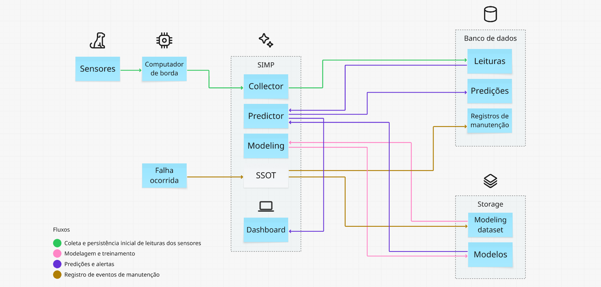
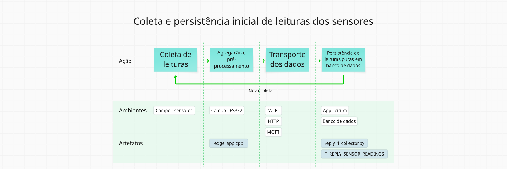
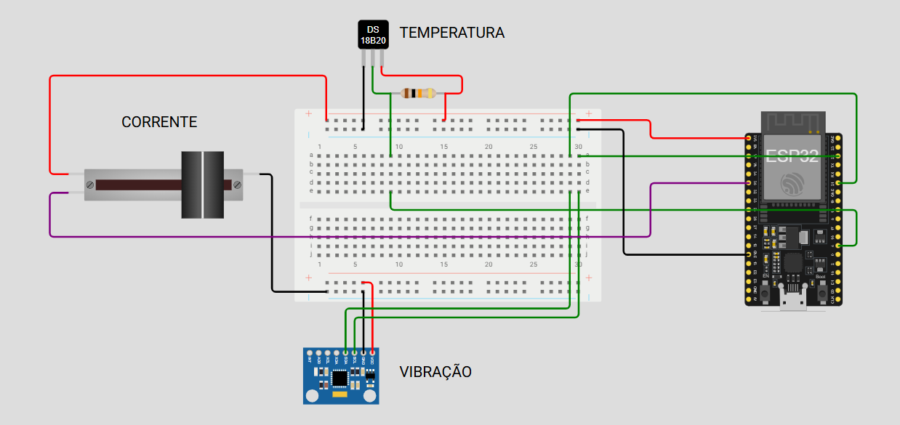
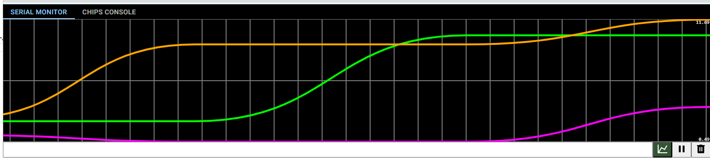
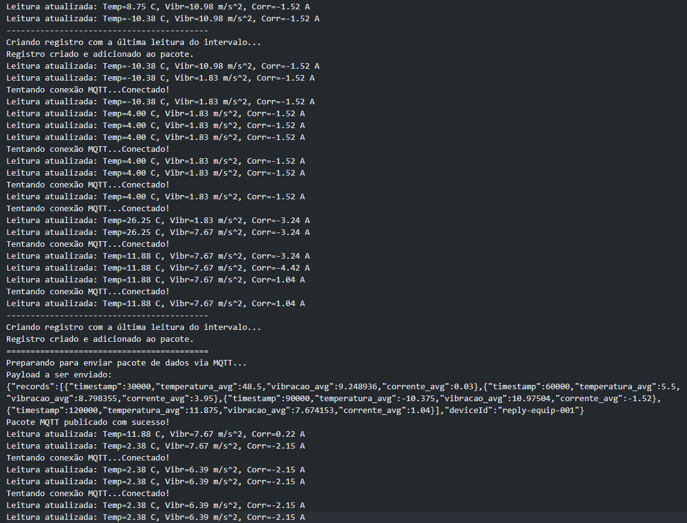
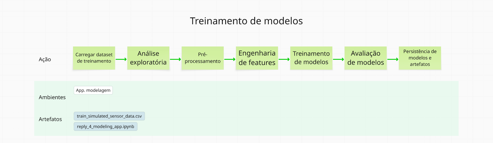
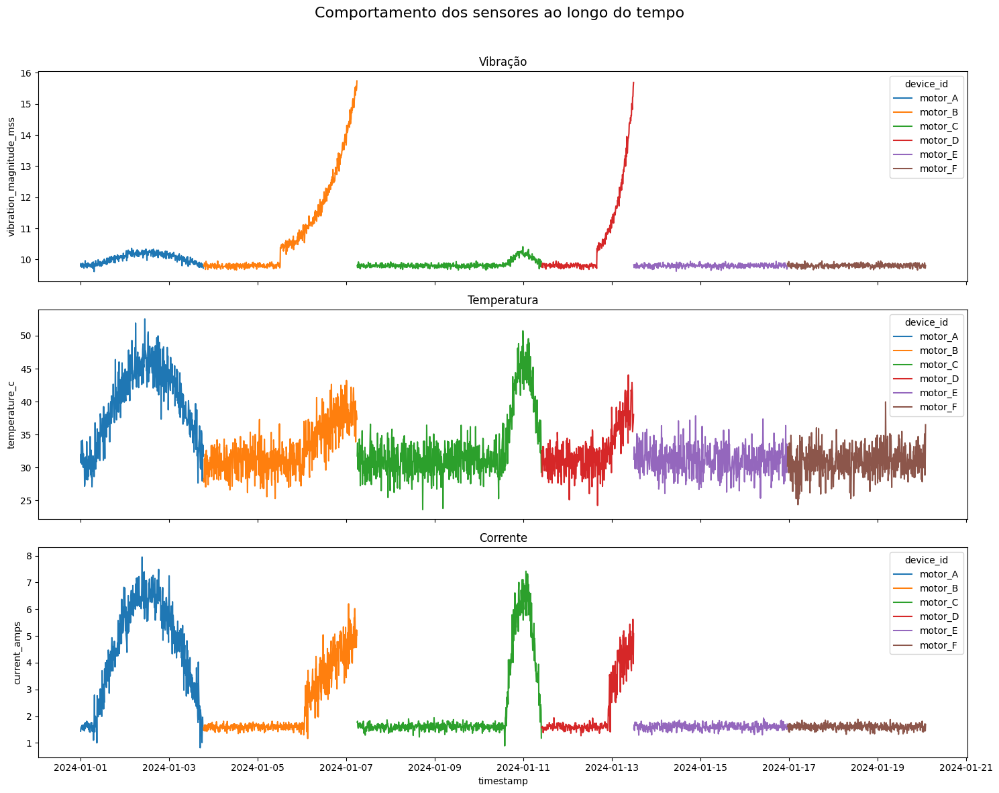
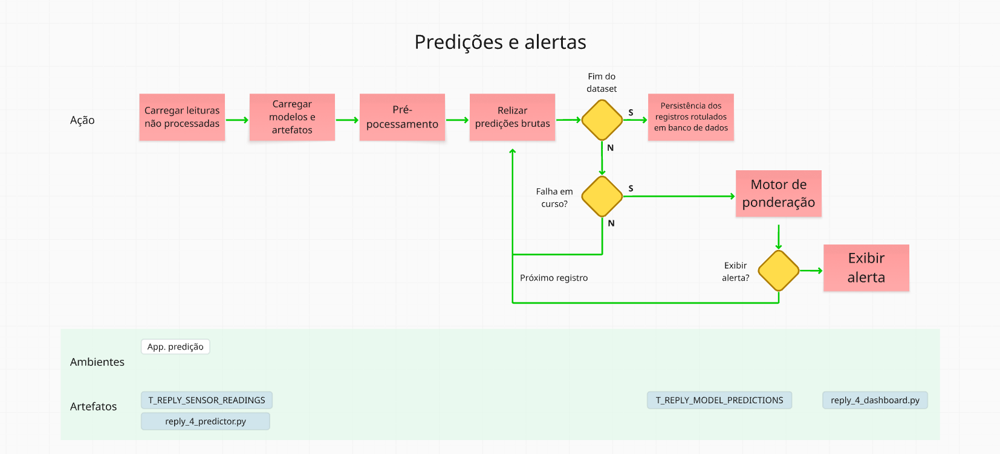
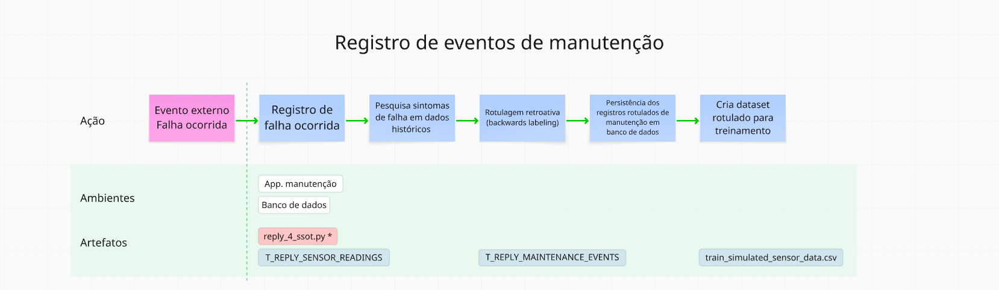
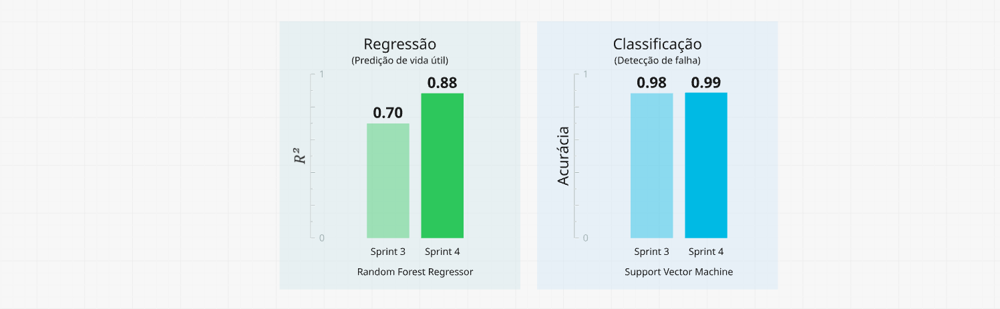

## FIAP - Faculdade de Informática e Administração Paulista

<p style="padding-top: 40px">
    <a href= "https://www.fiap.com.br/">
        
    </a>
</p>

<br>

# Reply - Enterprise Challenge - SIMP - Sistema Inteligente de Manutenção Preditiva
### Sprint 3

## Grupo TiãoTech

<p style="padding-top: 10px;">
    
</p>

## Integrantes
- <a href="https://www.linkedin.com/in/edmilson-marciano-02648a33">RM565912 - Edmilson Marciano</a>
- <a href="https://www.linkedin.com/in/jayromazzi">RM565576 - Jayro Mazzi Junior</a>
- <a href="https://www.linkedin.com/in/lucas-a-5b7a70110">RM563353 - Lucas Arcanjo</a>
- <a href="https://www.linkedin.com/in/vinicius-andrade-01208822b">RM564544 - Marcus Vinicius de Andrades Silva Malaquias</a>

## Professores
### Tutor(a) 
- <a href="https://www.linkedin.com/in/lucas-gomes-moreira-15a8452a">Lucas Gomes Moreira</a>
### Coordenador(a)
- <a href="https://www.linkedin.com/in/andregodoichiovato">Andre Godoi Chiovato</a>


## Objetivos desta entrega

O principal objetivo desta entrega é desenvolver um mínimo produto viável, ou MVP, que agregue os conceitos e características tratados nas entregas anteriores e que entregue valor perceptível como solução de ponta a ponta para manutenção preditiva.

## Vídeo explicativo

> - [FIAP / Reply - Sprint 3](https://www.youtube.com/watch?v=1H88-qi-KX8)


## Visão geral da solução
<br>


*<center><sub>Visão geral da solução</sub></center>*

## Descrição dos conceitos

A seguir descrevemos os principais fluxos previstos para a solução:


*<center><sub>Coleta e persistência inicial de leituras dos sensores</sub></center>*

**Objetivo**

Coletar, via MQTT, as leituras enviadas pelos computadpores de borda, que estão conectados aos sensores e armazená-las no banco de dados para posterior processamento.

**Componentes**

### Computação de campo

Esta solução inclui um kit de campo composto por três sensores acoplados a um motor industrial:
> - Sensor de temperatura
> - Sensor de vibração
> - Sensor de corrente elétrica

Os sensores estão conectados a um ESP32, enviando sinais periodicamente. 
O ESP32 foi programado¹ para receber as leituras em intervalos regulares e realizar um pré-processamento dos sinais, conforme segue:
> - Recebe as leituras dos sensores em intervalos pré-determinados;
> - Agrega os valores de vibração nos 3 eixos dimensionais em um único valor;
> - Agrega leituras dos sensores em registro único, temporalmente identificadas;
> - Compõe um payload em JSON com um número determinado de leituras;
> - Envia o payload completo em intervalos pré-determinados.

¹ - Veja o código em `src/adge_app.cpp`

### Simulação de sensores e ESP32

Para este MVP, os sensores foram simulados utilizando-se o Wokwi. O circuito utilizado na simulação é mostrado na figura a seguir:


*<center><sub>Circuito de simulação de IoT</sub></center>*


*<center><sub>Serial plotter do Wokwi durante a simulação</sub></center>*


*<center><sub>Texto do serial monitor do Wokwi durante a simulação</sub></center>*

### Simulação dos dados para predição

Considerando que os dados efetivamente trazidos do Wokwi não têm valor analítico, das as limitações do simulador, criamos um dataset de dados que procuram imitar os sinais que seriam gerados em uma situação real pelos sensores. Esses dados foram criados a partir de um script desenvolvido especificamente para esse fim (veja o [script para geração de dados para predição](src/predict_data_generation_4.ipynb) e o [dataset simulado para predição](data/predict/dados_teste_para_predicao_1.csv)). 

### Serviço coletor

Conecta o broker MQTT para receber os pacotes enviados pelo ESP32 periodicamente, formata os registros adequadamente e os envia ao banco de dados, populando a tabela ```T_REPLY_SENSOR_READINGS```.


*<center><sub>Modelagem e treinamento</sub></center>*

**Objetivo**

> Criar e avaliar os modelos de Machine Learning utilizados na presente solução, assim como criar os demais artefatos necessários à sua reprodutibilidade em diferentes ambientes.

**Componentes**

### Dataset para treinamento

O conjunto de registros que seria utilizado em um ambiente de produção não é composto por leituras puras. Ele recebe a intervenção humana de forma a adicionar os rótulos necessários à identificação de ocorrências de falhas e de intervalos temporais que acusem comportamentos anômalos.

### Simulação dos dados para treinamento

Para o presente MVP, criamos um conjunto de registros já rotulados, de forma a reproduzir o log de manutenção que compõe a 'fonte de verdade' (SoT) do nosso sistema. Esses dados foram criados a partir de um script desenvolvido especificamente para esse fim (veja o [script para geração de dados para treinamento ```train_complex_data_generation_4.ipynb```](src/train_complex_data_generation_4.ipynb) e o [dataset simulado para treinamento ```training_dataset_complex.csv```](data/ingest/training_dataset_complex.csv)).


*<center><sub>Aspecto dos sinais simulados</sub></center>*

### App. de treinamento

O [script para treinamento ```reply_4_modeling_app.ipynb```](src/reply_4_modeling_app.ipynb) executa as seguintes funções:

> - **Análise exploratória (EDA)** - Entender as características e relações nos dados dos sensores.
> - **Engenharia de features** - Extrair informações adicionais do `timestamp` para enriquecer o modelo.
> - **Treinamento de modelos**
>    * **Regressão** - Prever os "dias para a falha" (`days_to_failure`).
>    * **Classificação** - Identificar o "modo de falha" (`failure_mode`).
> - **Avaliação** - Medir a performance dos modelos de forma robusta e confiável.
> - **Exportação** - Salvar os modelos treinados e artefatos³ para uso em produção.

³ - Os modelos e artefatos encontram-se na pasta ```models```.


*<center><sub>Predições e alertas</sub></center>*

**Objetivo**

Carregar da base de dados as leituras de sensores e submetê-las aos modelos de ML para predição da saúde dos equipamentos monitorados e eventual emissão de alertas.

**Componentes**

### App. de predição

O [script para predição ```reply_4_predictor.py```](src/reply_4_predictor.py) é o responsável pelas atividades de predição efetiva e executa as seguintes tarefas:

> - **Pré-processamento de dados** - Carrega as leituras do banco de dados e aplica as mesmas transformações usadas nos dados de treinamento, como codificação e escalonamento, adequando os dados aos modelos treinados.
> - **Predições** - Utiliza os modelos criados anteriormente para realizar as predições a partir dos dados.
> - **Motor de ponderação** - Utiliza um mecanismo de avaliação segundo regras de negócio configuráveis, para classificar as predições e gerar alertas.
> - **Emissão de alertas** - Emite os alertas necessários.


*<center><sub>Registro de eventos de manutenção</sub></center>*

**Objetivo**

Constituir a 'fonte de verdade', ou seja, o repositório único de informações sobre a saúde dos equipamentos, ocorrência de falhas e registro de comportamentos anômalos.

**Componentes**

### App. de manutenção

Embora não tenha sido desenvolvida para este MVP, é um dos componentes mais importantes do sistema e que permite, em última instância, gerar os datasets históricos para treinamento e revisão de modelos. As funcionalidade mais importantes são destacadas na figura acima.


##  Melhoramentos a partir das entregas anteriores

### Modelos aperfeiçoados

Analisando as entregas anteriores, pudemos identificar várias oportunidades de melhoria que contribuíram para que os modelos atingissem métricas bastante favoráveis, como destaca a figura a seguir:


*<center><sub>Comparação dos modelos</sub></center>*

Os modelos de regressão e classificação foram significativamente aprimorados através de quatro melhoramentos estratégicos focados na qualidade dos dados e na metodologia de treinamento, resultando em métricas de performance robustas e confiáveis, como mostra a figura acima. 

Destacamos algumas melhorias:

#### Geração de um dataset de treinamento mais robusto

O dataset inicial, que mostrava um comportamento uniforme, foi substituído por um conjunto de dados mais rico, simulando múltiplos "ciclos de vida" de diferentes equipamentos. Isso introduziu uma variedade de cenários, incluindo falhas que ocorrem em estágios iniciais e tardios, e períodos de operação totalmente normais, refletindo um ambiente industrial mais realista e eliminando o viés dos dados originais.

#### Engenharia de features temporais

A coluna `timestamp`, antes ignorada, foi processada para extrair features cíclicas (hora do dia, dia da semana). Essas features foram codificadas matematicamente (usando seno e cosseno) para permitir que os modelos identificassem padrões dependentes do tempo, como diferenças entre turnos de operação ou variações de temperatura ambiente.

#### Tratamento do desbalanceamento de classes

Foi aplicado o parâmetro `class_weight='balanced'` ao modelo de classificação (SVM). Essa técnica ajustou o algoritmo para dar mais importância à classe minoritária (`desgaste_rolamento`), corrigindo o viés do modelo e aumentando significativamente sua capacidade de detectar corretamente esse tipo de falha (melhora no **recall**).

#### Adoção de uma metodologia de validação estratificada

A divisão dos dados entre treino e teste foi ajustada para usar a estratificação (`stratify`). Isso garantiu que ambos os conjuntos de dados contivessem uma proporção representativa de cada modo de falha, proporcionando um benchmark de avaliação justo e resultando em métricas de performance que refletem a real capacidade preditiva dos modelos.


### Algumas funcionalidades e melhoramentos implementados na solução

#### Uso da magnitude vetorial (vibração)
Para traduzir os dados brutos de vibração do sensor MPU6050, que são fornecidos em três eixos (X, Y, Z), foi implementado o cálculo da **magnitude vetorial (`√x² + y² + z²`)**. Essa abordagem consolida as três medições em uma única métrica robusta que representa a intensidade total da vibração, independentemente da sua direção. Isso garante que o dado enviado pelo ESP32 seja compatível com a entrada esperada pelos modelos de Machine Learning.

#### Fonte de dados híbrida na demonstração (Wokwi + CSV)
Para a demonstração do Coletor, foi adotada uma estratégia híbrida. A chegada de uma mensagem MQTT do Wokwi é usada como um **gatilho em tempo real**, provando a conectividade do sistema. No entanto, o conteúdo dessa mensagem é descartado e, em seu lugar, o script insere a próxima linha de um arquivo CSV pré-gerado. Isso garante que os dados processados e armazenados sejam de alta qualidade e sigam uma progressão de falha realista, permitindo uma demonstração de predição com resultados significativos.

#### Processamento temporal dos dados
Esta etapa teve duas fases críticas para permitir que os modelos "entendam" o tempo:
* **Engenharia de Features:** O `timestamp` bruto foi processado para extrair features numéricas e cíclicas, como a hora do dia e o dia da semana. Essas features foram codificadas matematicamente (com seno e cosseno) para que o modelo pudesse aprender padrões temporais (ex: diferenças de operação entre turnos).
* **Metodologia de Divisão:** A divisão dos dados para treino e teste foi feita de forma estratificada para garantir que todas as classes de falha estivessem representadas de forma justa na avaliação, gerando métricas de performance confiáveis.

#### Motor de regras de Nnegócio (validação de predições)
Foi criada uma camada de pós-processamento, chamada de "motor de regras", que analisa as saídas brutas de ambos os modelos (classificação e regressão). Sua função é aplicar o "bom senso" para identificar e tratar **predições logicamente conflitantes** (ex: status "Normal" com previsão de falha em 2 dias). O sistema traduz essas incongruências em um status final validado e um nível de alerta acionável (`Crítico`, `Atenção`), aumentando significativamente a confiabilidade e a utilidade das saídas do sistema.

#### Uso do SQLAlchemy (abstração e segurança no acesso a dados)
Para a comunicação entre os scripts Python e o banco de dados, foi utilizada a biblioteca SQLAlchemy. Sua implementação trouxe três vantagens principais:
* **Portabilidade:** Permitiu que os scripts fossem facilmente adaptados para o banco de dados Oracle do projeto, apenas alterando a string de conexão.
* **Segurança:** Garantiu que todas as interações com o banco, mesmo as que usam SQL nativo, fossem seguras contra ataques de *SQL Injection*.
* **Robustez:** Abstraiu o gerenciamento de conexões e transações, alinhando o projeto com as melhores práticas de engenharia de software para acesso a dados.

## Conclusão

Nesta fase do projeto, foi concluído com sucesso o desenvolvimento e a validação de uma pipeline completa para manutenção preditiva, desde a coleta de dados de sensores até a geração de alertas inteligentes. A implementação resultou em modelos de Machine Learning com alta capacidade preditiva (Acurácia de Classificação > 0.99 e R² de Regressão > 0.88), validados por uma metodologia robusta de pré-processamento e engenharia de features. 

O sistema, arquitetado de forma modular, está composto por serviços independentes para coleta e análise de dados, e incorpora um motor de regras de negócio para traduzir as predições em alertas acionáveis e confiáveis. A entrega atual estabelece uma base técnica sólida, demonstrando a viabilidade do projeto e preparando o sistema para as próximas fases de testes em ambiente real.


**Grupo TiãoTech**

---

### Estrutura de pastas

Dentre os arquivos e pastas presentes na raiz do sprint 3, definem-se:

- **assets**: imagens.

- **data/database**: script SQL do banco de dados.

- **data/ingest**: dataset para treinamnto dos modelos

- **data/predict** - dataset para predições

- **models**: Modelos de ML treinados

- **sensors_wokwi**: Daods do projeto do computador de borda.

- **src**: Código fonte da aplicação

- **README.md**: este documento.

*Foram removidas as pastas default vazias.*

### Licença

<p xmlns:cc="http://creativecommons.org/ns#" xmlns:dct="http://purl.org/dc/terms/"><a property="dct:title" rel="cc:attributionURL" href="https://github.com/agodoi/template">MODELO GIT FIAP</a> por <a rel="cc:attributionURL dct:creator" property="cc:attributionName" href="https://fiap.com.br">Fiap</a> está licenciado sobre <a href="http://creativecommons.org/licenses/by/4.0/?ref=chooser-v1" target="_blank" rel="license noopener noreferrer" style="display:inline-block;">Attribution 4.0 International</a>.</p>


